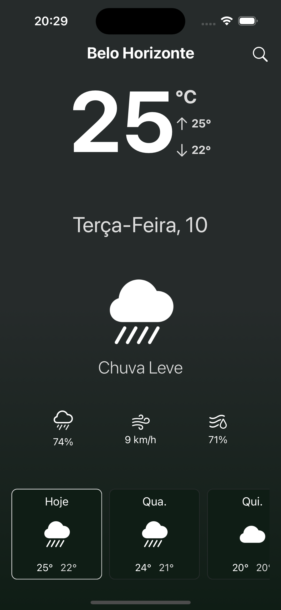
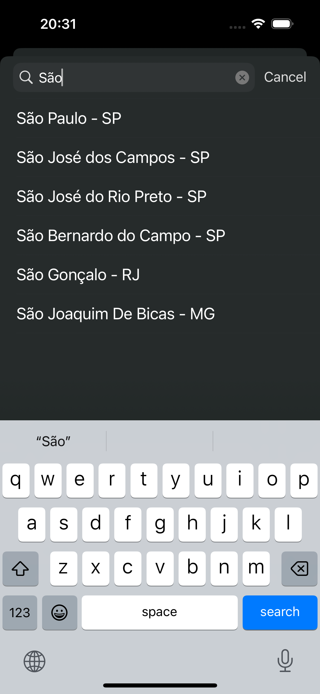

# WeatherApp - Aplicativo iOS de Previsão do Tempo

Este aplicativo proporciona previsões meteorológicas para várias cidades e foi concebido com o objetivo de aprender a desenvolver aplicativos nativos para iOS, seguindo o padrão de projeto MVVM.


<div style="display: flex; justify-content:space-around;"> 
    
    
    
</div>

## Recursos

- **Previsão do Tempo**: O aplicativo fornece informações detalhadas sobre o tempo atual e previsões de 5 dias para a cidade selecionada.

- **Busca por Cidade**: Os usuários podem pesquisar e selecionar cidades para verificar a previsão do tempo. O aplicativo suporta a busca por nome da cidade.

- **Detalhes Meteorológicos**: As informações exibidas incluem temperatura atual, máxima, mínima, umidade, vento e probabilidade de chuva.

## Requisitos

- iOS 13.0 ou posterior
- Xcode 12.0 ou posterior
- Conexão à internet para obter dados meteorológicos em tempo real

## Configuração

Antes de executar o aplicativo, é necessário configurar a chave da API de previsão do tempo. Siga as etapas abaixo:

1. Obtenha uma chave da API gratuita do [OpenWeatherMap](https://openweathermap.org/).

2. Abra o projeto no Xcode.

3. No projeto, encontre o arquivo `Config.swift`.

4. Substitua `"YOUR_API_KEY_HERE"` pela sua chave da API do OpenWeatherMap.

```swift
struct Config {
    static let apiKey = "YOUR_API_KEY_HERE"
}
```

## Como Usar

1. Abra o aplicativo no simulador do Xcode ou em um dispositivo iOS.

2. Na tela inicial, insira o nome da cidade na barra de pesquisa.

3. Selecione a cidade desejada na lista de sugestões.

4. A previsão do tempo para a cidade selecionada será exibida na tela principal.

5. Toque em uma das previsões de 5 dias para obter mais detalhes sobre o clima.

## Estudo aplicado

- Swift.
- UIKit framework.
- ViewCode.
- MapKit.
- URLSession.
- MVVM.

## Licença

Este aplicativo é distribuído sob a licença MIT.

---
